## Nature omniprésente

J'ai eu plusieurs occasions de visiter la ville, que ce soit lors du Pub Crawl, en me baladant seul, en compagnie d'autres étudiants ou encore lors de la visite guidée en bus de la ville organisée par l'université.

L'une des choses les plus intéressantes à propos de Tampere, c'est à quel point la nature est omniprésente. Alors oui, venant d'un Parisien, beaucoup vont rigoler 😒. Mais en réalité, c'est assez impressionnant. La ville est entourée de lacs, de forêts, de parcs, et même en ville, on trouve des arbres et des parcs partout. J'ai pu discuter avec des étudiants en urbanisme qui m'ont expliqué que la ville est un très bon exemple de la manière de construire une ville en harmonie avec la nature.

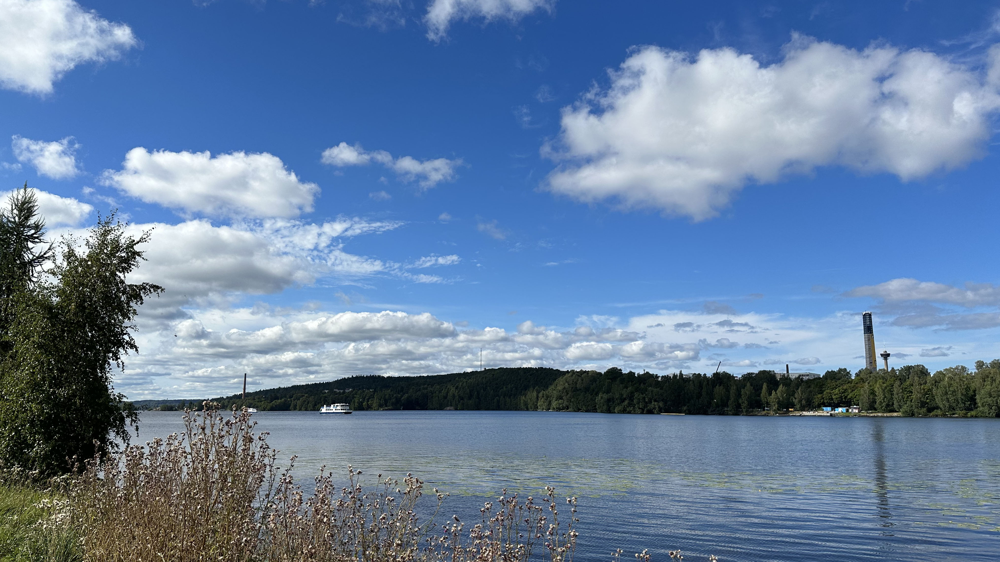
Lac à l'ouest de la ville

Ici, il suffit de marcher moins d'une demi-heure depuis le centre-ville ou n'importe où pour se retrouver au milieu d'une forêt de pins/bouleaux ou au bord d'un lac. C'est assez impressionnant, et ça change de Paris 😁. Voici par exemple un parc à l'ouest de la ville, l'arboretum de Hatanpää, à 20 minutes à pied du centre-ville :

Et un peu plus au nord de ce dernier, une petite plage (à droite des photos) :

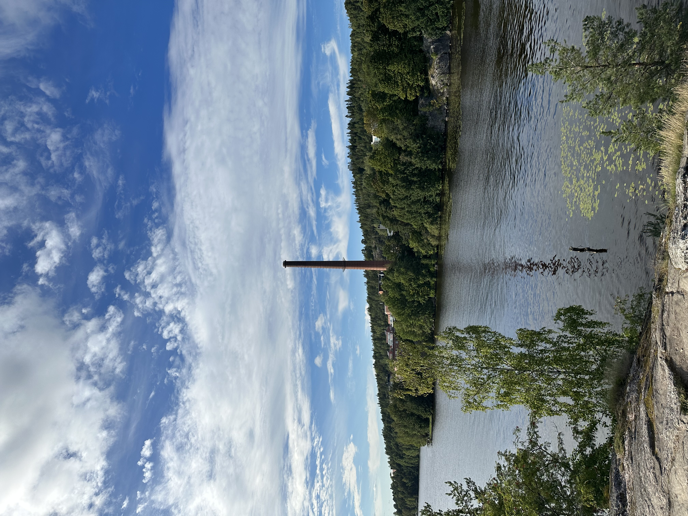
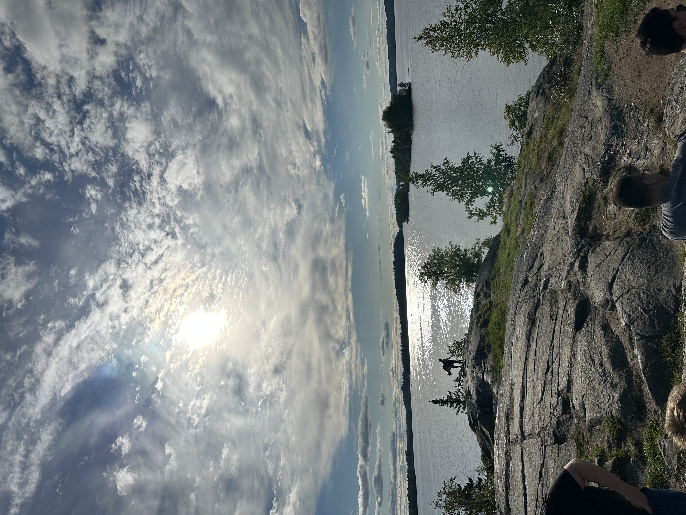

Et encore plus au nord, une magnifique zone plus résidentielle :

Le plus impressionnant, c'est vraiment à quel point c'est si proche de la ville. Lors d'un événement, on a pu se retrouver sur une plage au bord du lac, à 15 minutes de ma résidence :

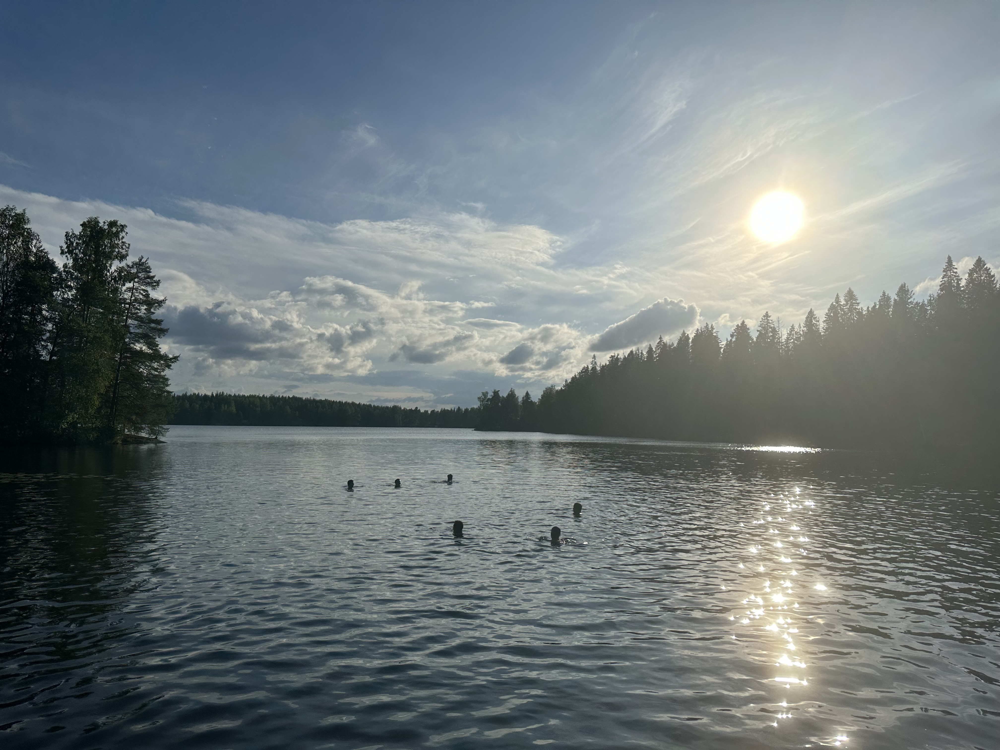
Je ne me suis pas baigné, mais beaucoup n'ont pas hésité 🥶

## Le centre-ville

Le centre-ville est assez petit, mais très agréable. Il y a beaucoup de commerces, de bars, de restaurants, de magasins, de coffee shops, etc.

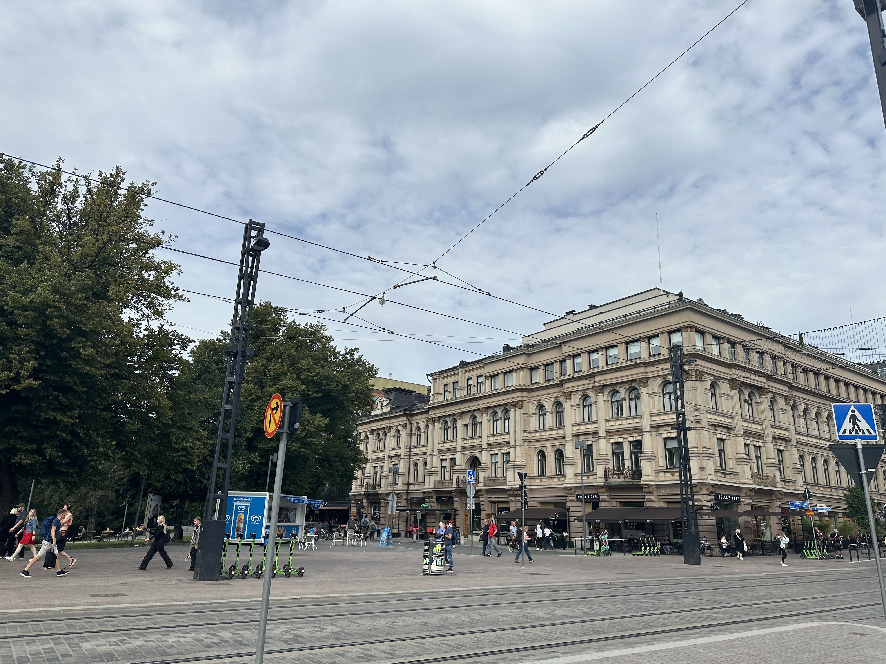

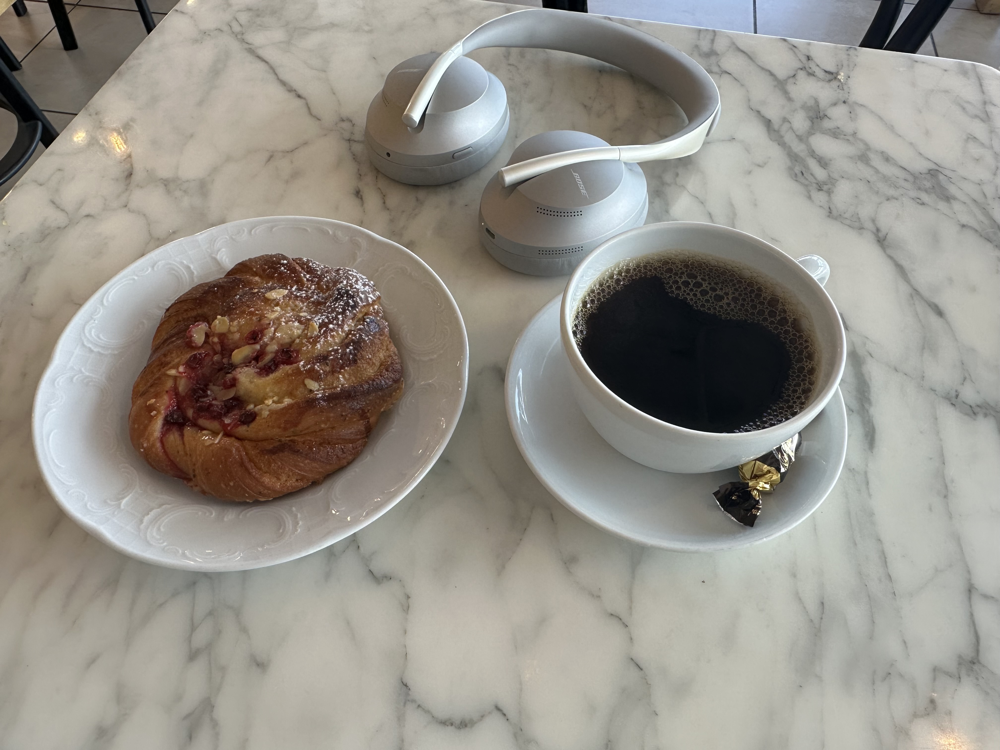
J'ai évidemment déjà profité des coffee shops

> ☕️ Les Finlandais boivent beaucoup de café, en revanche adieu les expressos et bonjour le filtre 😞. J'ai eu du mal à m'y faire, mais bon je commence à m'y habituer.

Il faut savoir que Tampere est une ville qui attache beaucoup d'importance à son histoire industrielle, et cela se ressent dans l'architecture de la ville. Il y a beaucoup de bâtiments en briques rouges et d'usines qui puisent leur énergie dans le fort courant du fleuve principal de la ville, le Tammerkoski.

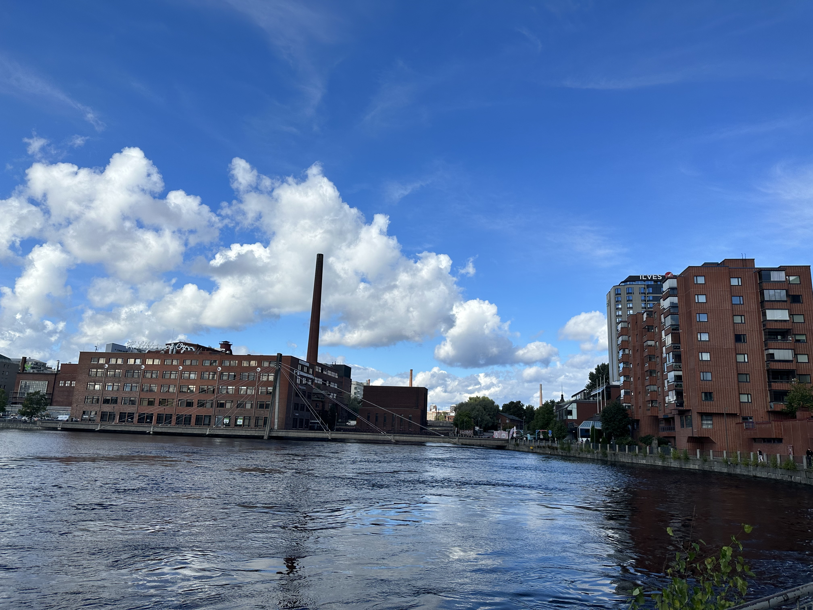

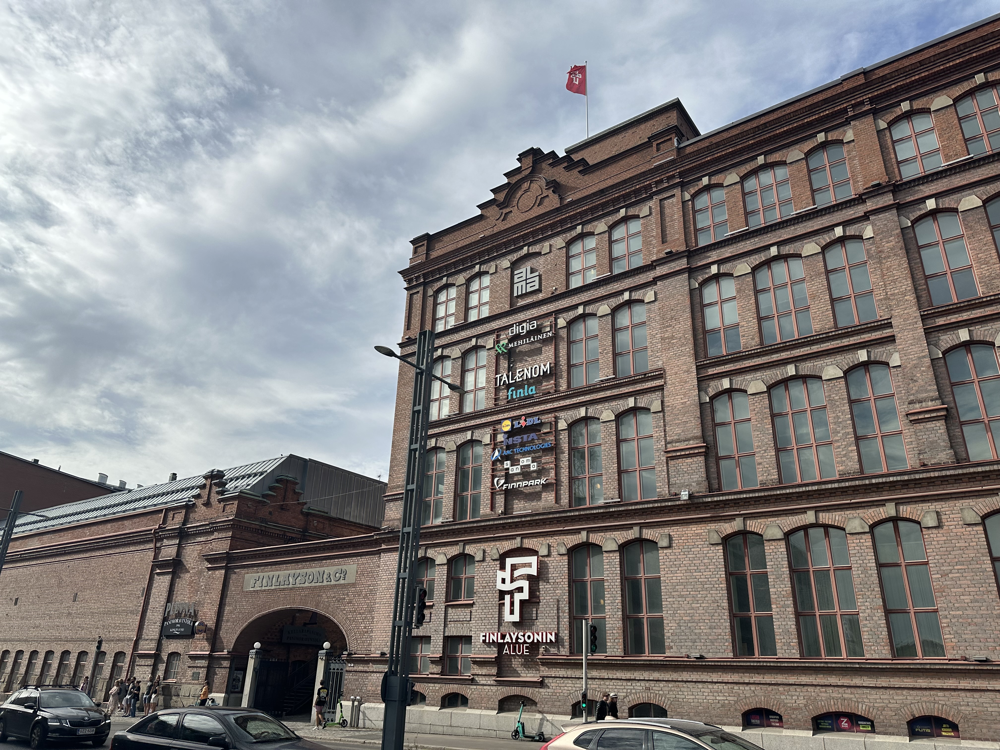

Finlayson, l'usine de textile la plus ancienne de Finlande, qui est
maintenant aussi un centre commercial

Ces industries et le fait que Tampere soit un carrefour entre Helsinki et les villes plus au nord ont fait de Tampere une ville très importante dans l'histoire de la Finlande et ont permis la rapide croissance de la ville.

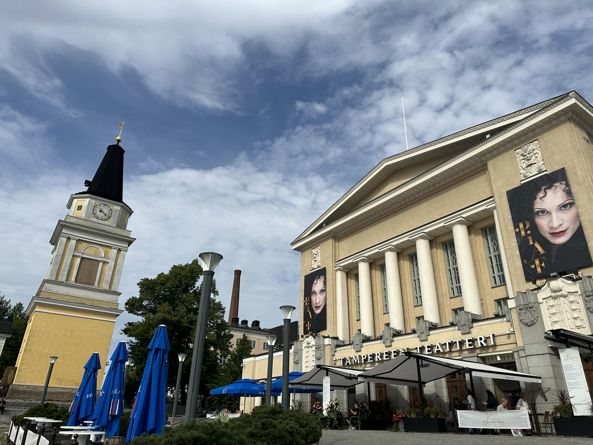
Le théâtre au cœur de la ville

C'est assez joli, et ça donne un charme particulier à la ville. Après, la ville n'est pas non plus exceptionnelle dans son ensemble 😅.

On retrouve aussi beaucoup d'influences russes et nordiques dans l'architecture de la ville :

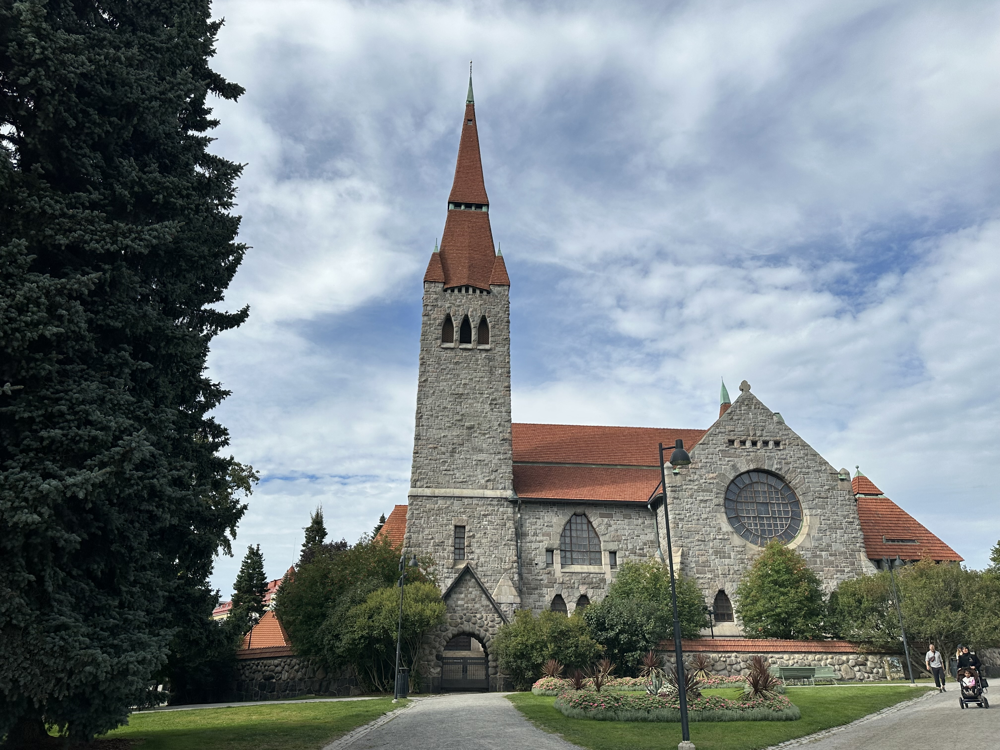
La cathédrale de Tampere

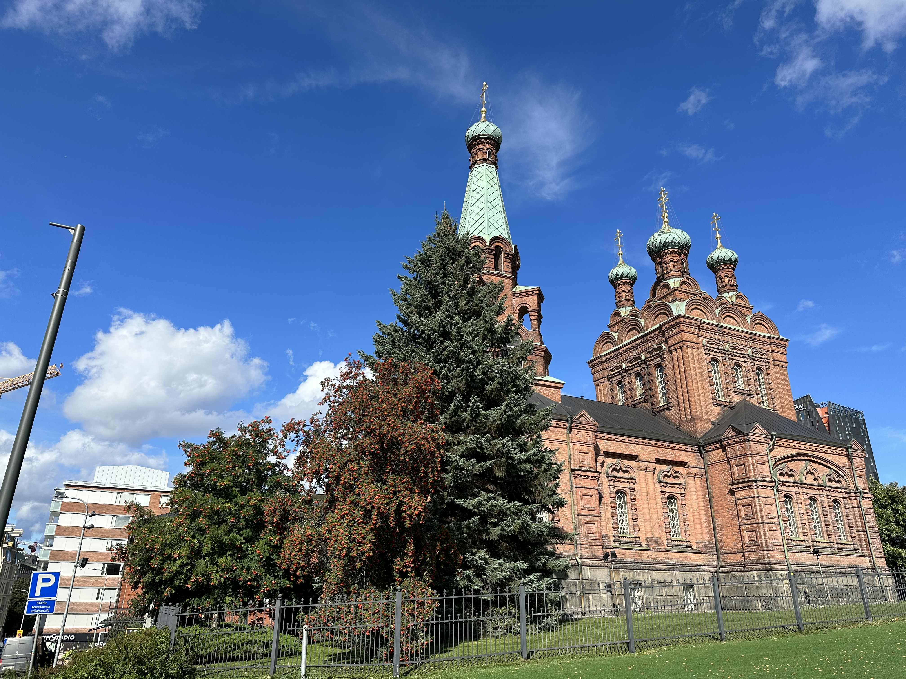
L'église orthodoxe de Tampere

## Les transports

Les transports en commun sont très bien développés ici. Il y a des bus et des tramways qui passent très régulièrement et qui sont trèèèès ponctuels. Pour ma part, je prends notamment régulièrement le tram pour aller à Hervanta, où se situe ma résidence et le campus principal pour les étudiants en ingénierie. Il y a très peu de voitures dans le centre, beaucoup de personnes se déplacent aussi en trottinette électrique et à vélo, et il y a des pistes cyclables partout.

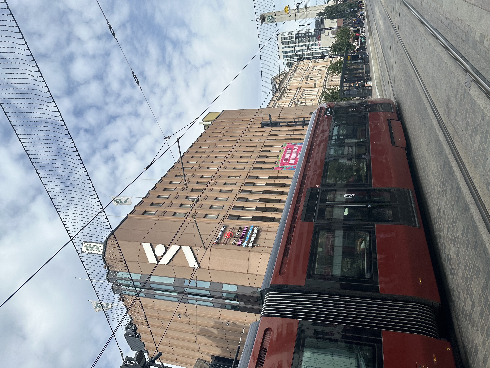

> [feux rouges et voitures]

En ce qui concerne les prix, la ville met à disposition des vélos pour 10€/mois (mais pas en hiver évidemment), et les transports en commun sont accessibles via paiement par téléphone ou une carte à environ 40€/mois pour les moins de 24 ans et les étudiants.

## Petit point météo 🌧

Terminons par la météo : actuellement, c'est assez mitigé. Il fait entre 15 et 20 degrés, et il pleut un jour sur deux. Mais ça ne m'a pas empêché de profiter de la ville et de faire des activités en extérieur. J'ai "hâte" de voir ce que ça donne en hiver 😁
